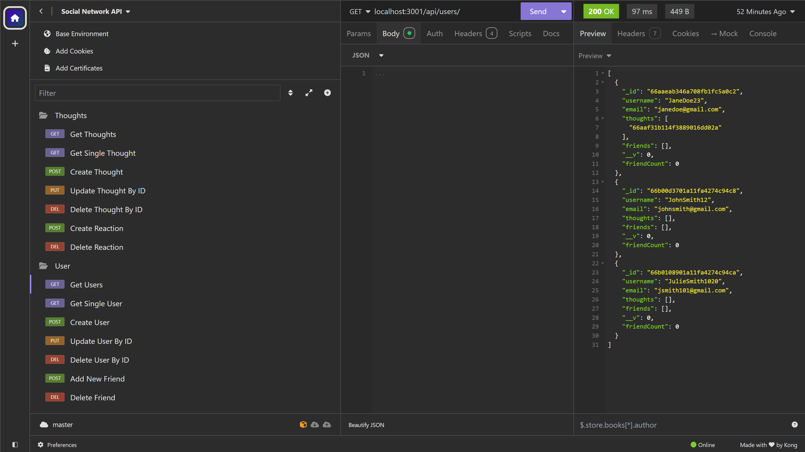

# NoSQL-Social-Network-API 

## Description

The motivation behind this project was to develop a social network API that allows users to share their thoughts as well as react to their friends' thoughts. The user can also create a friends list and are then able to react to their friend's thoughts. By developing this API users are now able to connect and express themselves by their thoughts or reactions. This project allowed me to gain more experience with Mongoose and being able to store unstructured data. 

## Usage

The user can start the application by using the npm start command. Once the server is running, the user can make a POST request in Insomnia to create new users and thoughts. The user can then view the users and thoughts by making a GET request to those routes.  The user also has the option to update or delete the users and thoughts by their ID by making a DELETE or PUT request. The user can also create and delete their reactions to another user’s thoughts. A friend can also be added or removed from the user’s friend list by making a POST or DELETE request. 

<a href="https://drive.google.com/file/d/1fLlvWebDmuz9HRFkgXZEg1-qeluAAXPA/view?usp=sharing">Walkthrough Demo</a>

